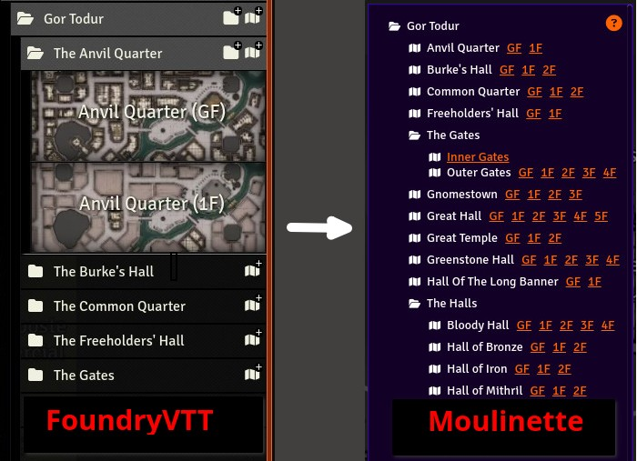
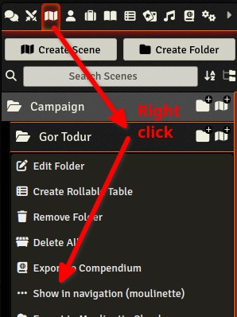
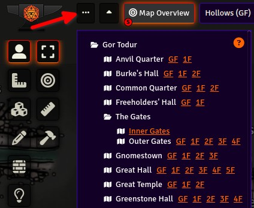
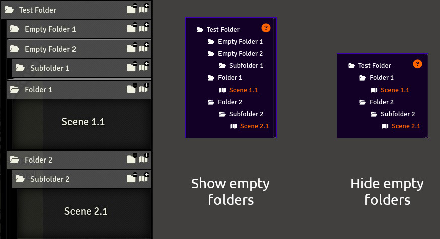
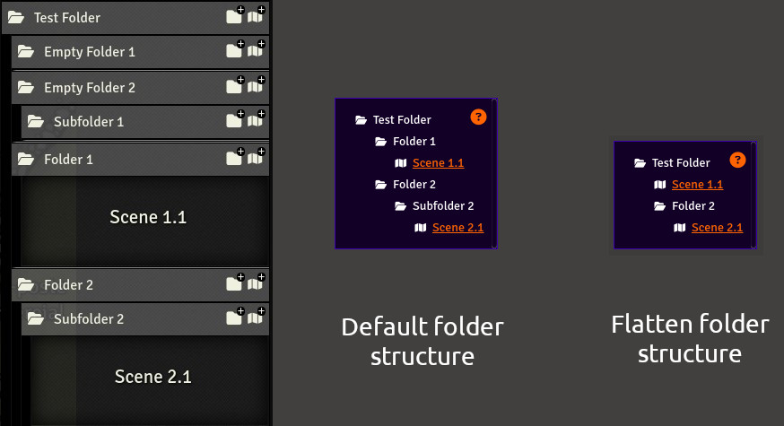
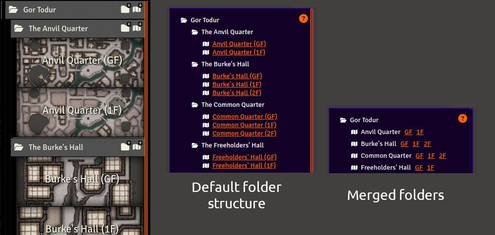

# Moulinette Navigation Tools

[](https://github.com/SvenWerlen/moulinette-navigation-tools/releases)
[](https://github.com/SvenWerlen/moulinette-navigation-tools/LICENSE.txt)
[](#install)

[](https://www.patreon.com/moulinette)

See [www.moulinette.cloud](https://www.moulinette.cloud) website.

This module provides an alternative view for navigating among scenes. The module is particularly useful if your campaign or adventure consists of many scenes organized in folders. By default, you need to click to open each folder and subfolder, and then two clicks are required to display or activate a scene. With this module, all scenes are presented, and you can switch from one scene to another with a single click.



**Main advantages**

* Having a quick and comprehensive view of all scenes in a folder
* Create a navigation view for a specific folder or subfolder
* Facilitate navigation for game masters by reducing the number of clicks required :

| Default behaviour | Moulinette Navigation |
| ----     | ----     |
| Click on "Scenes" tab<br>Expand folder (Gor Todur)<br>Expand folder (The Anvil Quarter)<br>Right click on scene<br> Select "View scene"<br>**5 clicks**   | Toggle navigation<br>Click on scene<br>**2 clicks**  |

## <a name="use"/>How to use it

To "fill" Moulinette navigation, you simply need to select the folder you want to display. Right-click on it and then select "Show in navigation (moulinette)"



Then, click on the button "..." at the top left in the navigation bar to show or hide the list of scenes.
In the list, click on a scene to display it, and hold down the "SHIFT" button to activate it.



## <a name="configurations"/>Configurations

### Hide empty folders

This configuration automatically hides all directories that do not contain scenes.



### Flatten the folder structure

When this option is enabled and a folder contains only one scene, Moulinette will not display the folder but only the scene to avoid cluttering the tree structure.



### Combine scenes (regex)

This configuration allows merging scenes based on their name. It's a regular expression representing the pattern used at the end of the scene names. 



The configuration uses a regular expression to identify the pattern to recognize and the part to extract during merging.

Here are some concrete examples:

#### Pattern #1 : use of parentheses (default)

If you name your scenes like this : 
* My Scene (GF)
* My Scene (1F)
* My Scene (2F)
* ...

You can then use the following regex to extract the part in parentheses: ```\((.+)\)```
_(Parentheses characters must be escaped `\(` and `\)`)_

#### Pattern #2 : use of '-' character

If you name your scenes like this : 
* My Scene - GF
* My Scene - 1F
* My Scene - 2F
* ...

You can then use the following regex to extract the part after the `-` character: ``` - (.+)```
_(You can replace `-` by any other character. Don't forget to escape it if it's a regex character)_


## <a name="install"/>Install the module

To **install** the module from FoundryVTT:
1. Start FVTT and browse to the Game Modules tab in the Configuration and Setup menu
2. Search for "Moulinette Navigation Tools" and click install

To **manually install** the module (not recommended), follow these instructions:
1. Start FVTT and browse to the Game Modules tab in the Configuration and Setup menu
2. Select the Install Module button and enter the following URL: https://raw.githubusercontent.com/svenwerlen/moulinette-navigation-tools/master/module.json
3. Click Install and wait for installation to complete 

## <a name="support"/>Support me on Patreon

If you like my work and want to support me, consider subscribing to Moulinette!

* Preferred: [Moulinette on Stripe](https://assets.moulinette.cloud/pricing) (requires Patreon authentication)
* Or: [Moulinette on Patreon](https://www.patreon.com/moulinette)

You can also join [Moulinette Discord](https://discord.gg/xg3dcMQfP2)
